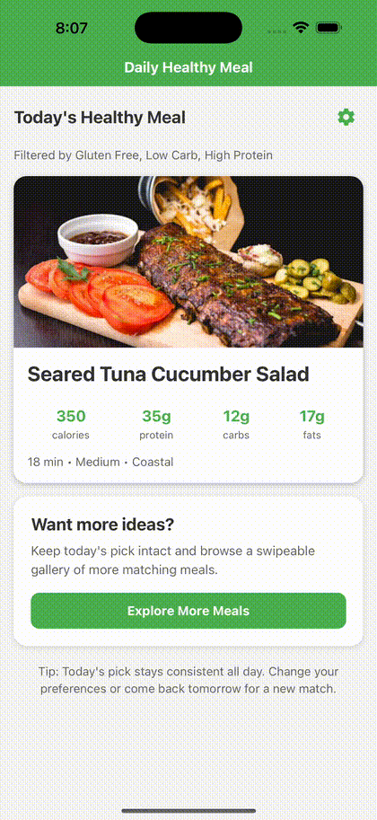
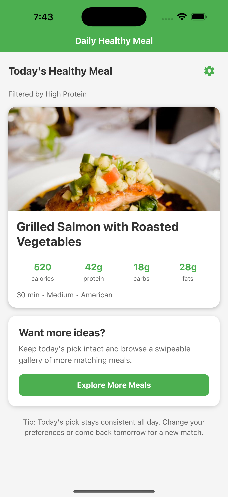
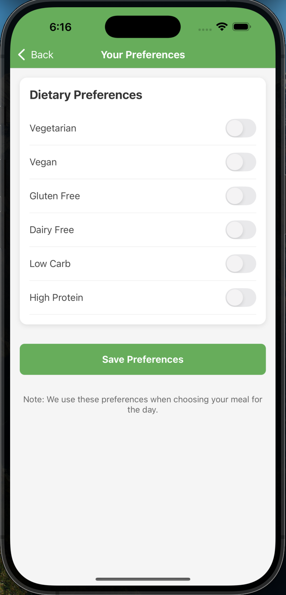
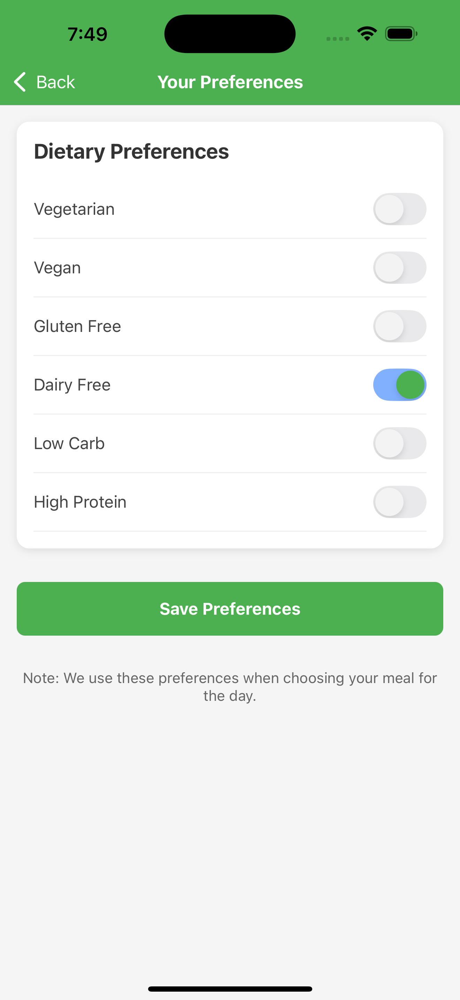
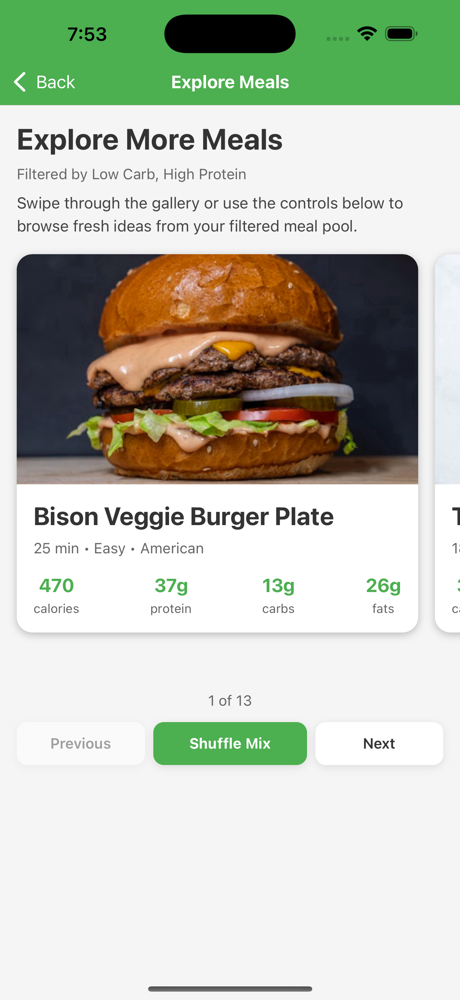
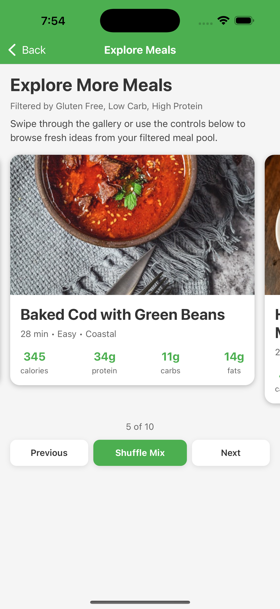
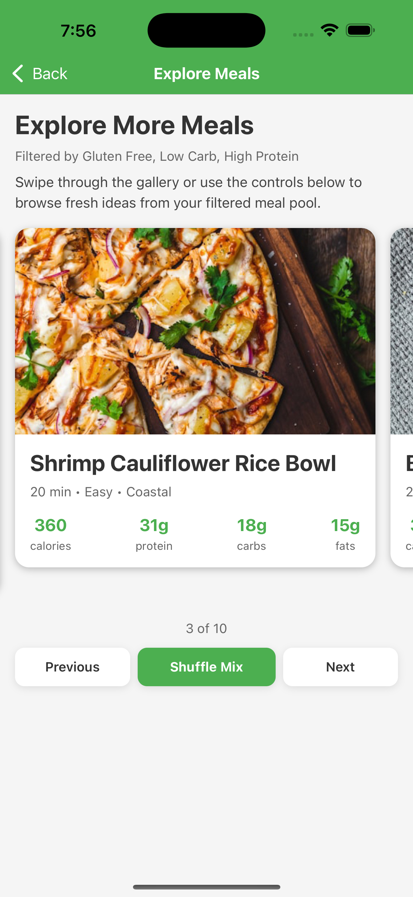
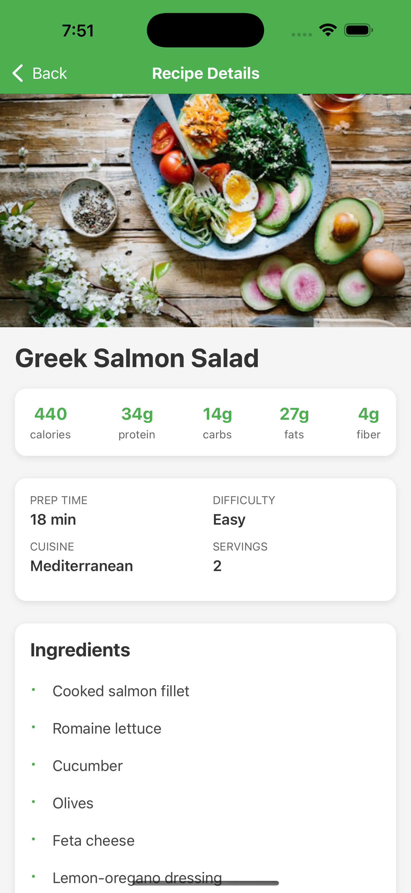
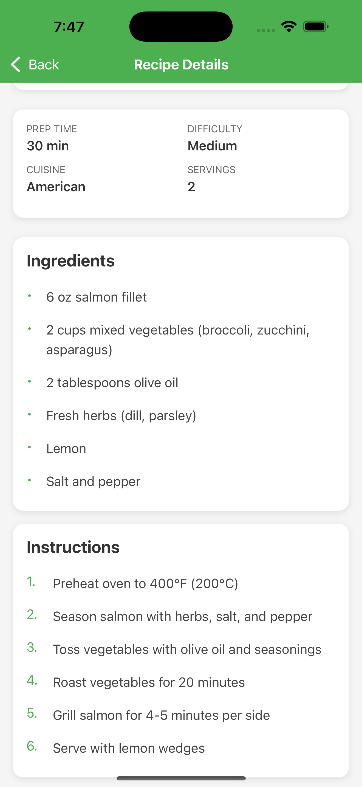
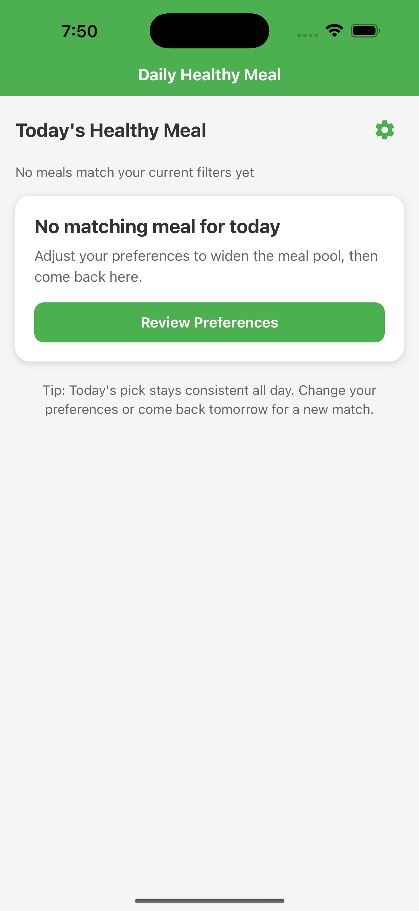

# Healthy Meal RN

Healthy Meal RN is an Expo + React Native app that suggests a deterministic healthy meal of the day, lets users save dietary preferences locally, and shows recipe details in a simple mobile-first flow.

## Current Status

This project is now beyond the original tutorial-style prototype stage. It currently includes:

- 4 production-like screens wired through React Navigation
- a 25-meal catalog with broader dietary coverage
- shared preference state access through a reusable hook
- canonical meal lookup by `mealId` instead of passing full objects through navigation
- a separate Explore gallery so users can browse more meals without breaking the daily-pick concept
- resilient remote image rendering with loading and fallback states
- shared theme tokens for colors, spacing, radii, and card shadows
- accessibility labels and loading semantics for key interactive flows
- 10 Jest test suites and 41 automated tests covering logic, data integrity, hooks, components, screen behavior, and one integration seam
- a GitHub Actions workflow that validates the repo on every push and pull request

## Demo

<p align="center">
  
</p>
<p align="center">
  <em>Quick preview of the daily meal flow, preferences update, Explore gallery, and recipe detail experience.</em>
</p>

## Screenshots

<table>
  <tr>
    <td align="center">
      <strong>Home</strong><br />
      
    </td>
    <td align="center">
      <strong>Preferences</strong><br />
      
    </td>
    <td align="center">
      <strong>Preferences With Filters</strong><br />
      
    </td>
  </tr>
  <tr>
    <td align="center">
      <strong>Explore Gallery</strong><br />
      
    </td>
    <td align="center">
      <strong>Explore Gallery Alt</strong><br />
      
    </td>
    <td align="center">
      <strong>Shuffle Mix</strong><br />
      
    </td>
  </tr>
  <tr>
    <td align="center">
      <strong>Recipe Detail</strong><br />
      
    </td>
    <td align="center">
      <strong>Recipe Instructions</strong><br />
      
    </td>
    <td align="center">
      <strong>No Match State</strong><br />
      
    </td>
  </tr>
</table>

## Why This Project Stands Out

- Builds a complete multi-screen mobile flow with React Navigation.
- Persists user preferences locally with AsyncStorage through a shared `usePreferences` hook.
- Uses deterministic daily selection instead of random reshuffling on every refresh.
- Resolves recipe detail screens from a canonical data source using `mealId`.
- Separates the stable daily recommendation from a swipeable Explore gallery.
- Handles remote image failures gracefully with cached image loading and fallback UI.
- Includes accessibility labels for key buttons, switches, and loading states.
- Handles no-match and missing-data states instead of only the happy path.
- Ships with a lightweight GitHub Actions workflow to validate the repo on every push and pull request.

## Features

- Daily healthy meal suggestion on the home screen
- Swipeable Explore gallery with `Previous`, `Next`, and `Shuffle Mix` controls
- Dietary filters for vegetarian, vegan, gluten-free, dairy-free, low-carb, and high-protein preferences
- 25-meal catalog with broader coverage across common dietary combinations
- Persistent preferences saved on device
- Recipe detail screen with nutrition, ingredients, and cooking steps
- Expanded meal metadata including prep time, difficulty, cuisine, servings, and fiber
- Cached image loading with loading indicators and graceful fallback cards
- Empty-state guidance when no meals match the selected preferences
- Accessibility labels on key interactive elements and progress semantics for loading states
- Pull-to-refresh that reloads the current daily selection logic

## Tech Stack

- Expo SDK 52
- React Native 0.76
- React Navigation native stack
- AsyncStorage for local persistence
- `expo-image` for cached remote image rendering
- Jest + React Native Testing Library for automated tests
- lightweight shared design tokens through `lib/theme.js`

## Architecture Notes

- `data/meals.js`
  Stores the current meal catalog and metadata.
- `lib/mealUtils.js`
  Contains deterministic daily meal selection, filtering, summary generation, and canonical meal lookup.
- `lib/preferences.js`
  Contains preference defaults, normalization helpers, and formatting helpers.
- `lib/theme.js`
  Centralizes shared colors, spacing, radii, and shadow styles.
- `lib/types.js`
  Documents the `Meal` and `Preferences` shapes with lightweight JSDoc typedefs.
- `hooks/usePreferences.js`
  Centralizes AsyncStorage-backed preference load/save/toggle behavior.
- `components/MealCard.js`
  Reuses the shared tappable meal summary layout between Home and Explore.
- `components/MealImage.js`
  Wraps remote meal imagery with caching, loading feedback, and fallback UI.

## Project Structure

```text
.
├── App.js
├── app.json
├── components/
│   ├── MealCard.js
│   └── MealImage.js
├── data/
│   └── meals.js
├── docs/
│   └── screenshots/
│       ├── demo.gif
│       ├── demo.mov
│       ├── explore-1.png
│       ├── explore-2.png
│       ├── home.png
│       ├── instruc-ingred.png
│       ├── no-match.png
│       ├── preferences-on.png
│       ├── preferences.png
│       ├── recipe-detail.png
│       └── shuffle-mix.png
├── hooks/
│   └── usePreferences.js
├── lib/
│   ├── mealUtils.js
│   ├── preferences.js
│   ├── theme.js
│   └── types.js
├── screens/
│   ├── ExploreScreen.js
│   ├── HomeScreen.js
│   ├── PreferencesScreen.js
│   └── RecipeDetailScreen.js
├── __tests__/
│   ├── ExploreScreen.test.js
│   ├── HomeScreen.test.js
│   ├── HomeScreen.integration.test.js
│   ├── PreferencesScreen.test.js
│   ├── RecipeDetailScreen.test.js
│   ├── mealUtils.test.js
│   ├── mealsData.test.js
│   ├── MealImage.test.js
│   ├── preferences.test.js
│   └── usePreferences.test.js
└── assets/
```

## Local Setup

```bash
npm install
npm start
```

Useful Expo shortcuts:

- `npm run ios`
- `npm run android`
- `npm run web`

## Quality Checks

Run the local validation scripts:

```bash
npm run check
```

This currently verifies:

- JavaScript syntax across the app source
- Expo dependency compatibility with the installed SDK
- Pure logic and data validation tests for meal selection, preferences, and meal catalog integrity
- Direct abstraction tests for `usePreferences` and `MealImage`
- Screen-level behavior for Explore, Home, Preferences, and Recipe Detail
- One integration-style Home test covering `AsyncStorage -> preferences load -> daily meal render`

You can also run tests directly with:

```bash
npm test
```

## Manual Test Scenarios

Use these quick checks to verify the main product logic:

1. Open the app with all filters off and confirm the home screen shows a meal with `Showing all meals`.
2. Enable `High Protein` and confirm a high-protein meal is shown.
3. Enable `Vegan` and confirm a vegan meal is shown.
4. Enable `Vegan` + `High Protein` + `Low Carb` + `Gluten Free` and confirm the no-match empty state appears.
5. Return to Preferences, loosen filters, and confirm a meal appears again.
6. Open `Explore More Meals` from Home and confirm you can swipe between matching meals.
7. Use `Shuffle Mix` in Explore and confirm the gallery resets to a fresh order.
8. Tap a meal card and confirm Recipe Detail opens correctly from `mealId`-based navigation.
9. Temporarily break a meal image URL and confirm the fallback image card appears instead of a blank broken image.

## Resume-Friendly Highlights

- Designed and implemented a mobile meal recommendation flow using Expo and React Native.
- Built client-side persistence and preference-aware filtering logic with reusable shared hooks.
- Improved product reliability by adding graceful empty/error states, deterministic daily behavior, a separate Explore flow, resilient image fallbacks, and accessibility-aware UI labels.
- Added automated testing for core logic, data integrity, hooks, components, and screen behavior.
- Added an integration-style Home test to verify the real storage-to-selection-to-render path.
- Added repository automation with GitHub Actions to validate dependency compatibility and source integrity.

## Next Improvements

- Move from JSDoc typedefs to TypeScript if the project grows further
- Connect to a backend or CMS for dynamic meal content
